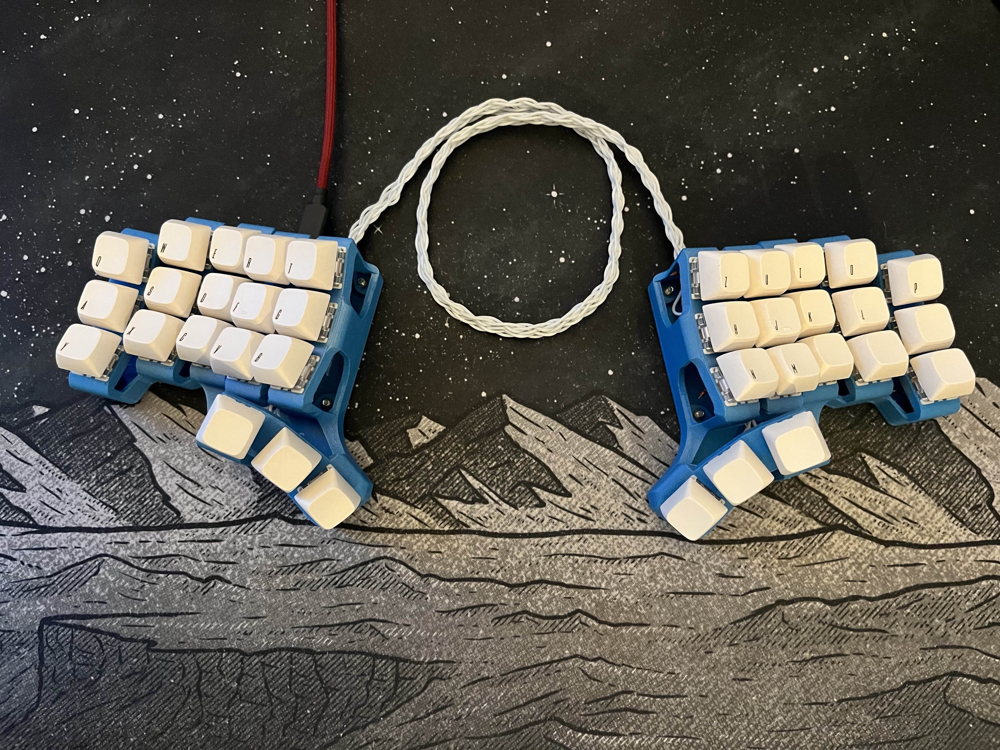
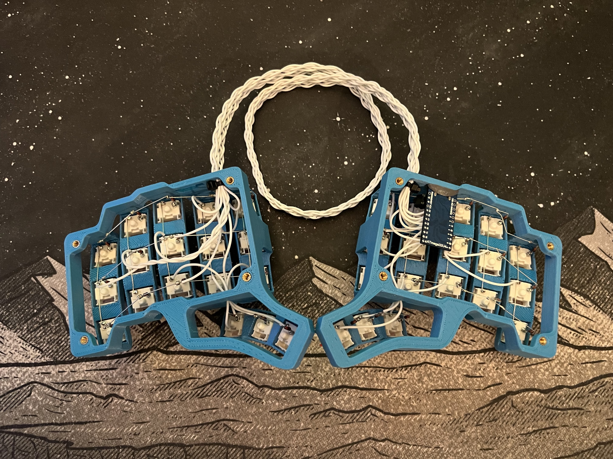

# skeletyl_handwire

If you have any questions/ideas/keymaps/problems feel free to reach out to _boozar#8086_ on discrod.

## Firmware
[Vial (QMK)](https://get.vial.today/download/)

### Keymaps
[Example keymaps](resources/vial_keymaps)

Feel free to reach out and provide yours!

## Hardware
10x4 Matrix

### Pins used
| Row/Column | ProMicro | Chip
| - | - | -
| R1 | F6 | A1
| R2 | F7 | A0
| R3 | B1 | 15
| R4 | B6 | 10
| C1 | B5 | 9
| C2 | B4 | 8
| C3 | E6 | 7
| C4 | B3 | 14
| C5 | B2 | 16
| C6 | D7 | 6
| C7 | C6 | 5
| C8 | D4 | 4
| C9 | F5 | A2
| C10 | F4 | A3

### Reset Switch
There is a reset switch soldered directly to the Pro Micro.
It can be reached by reaching in from the side.